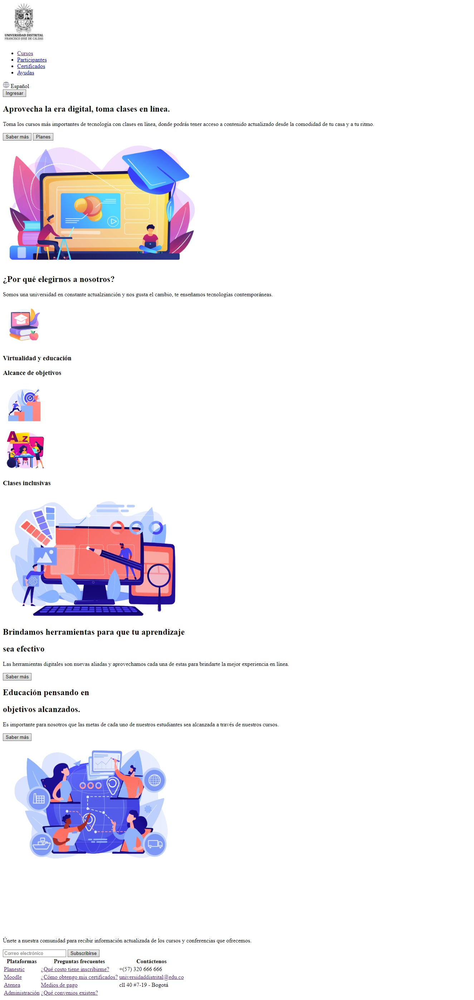
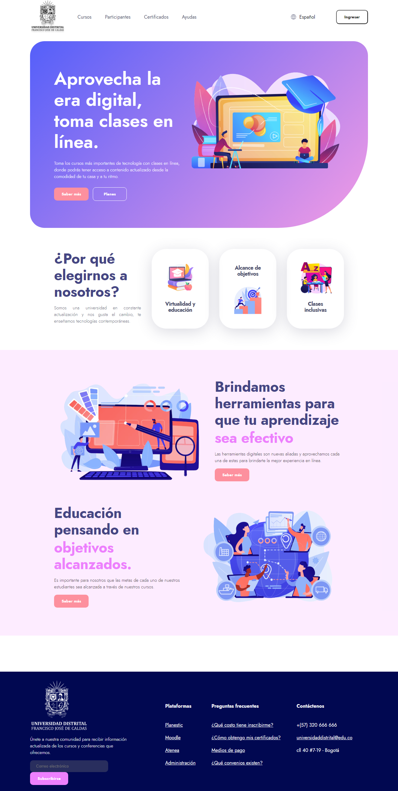
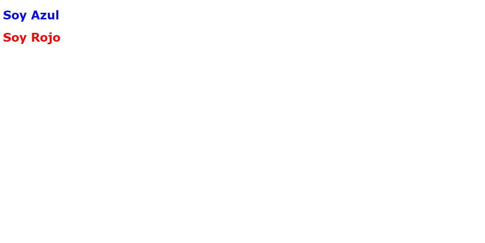
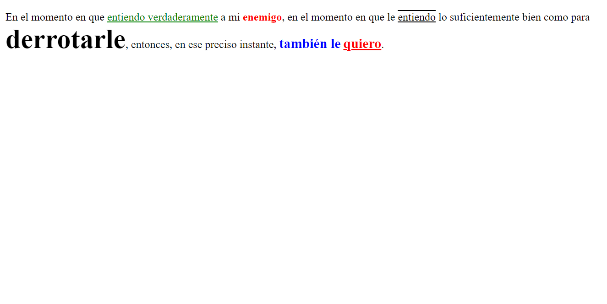
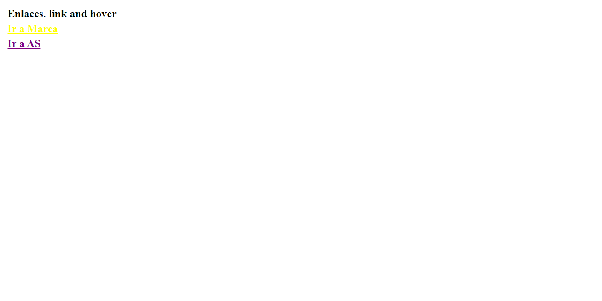
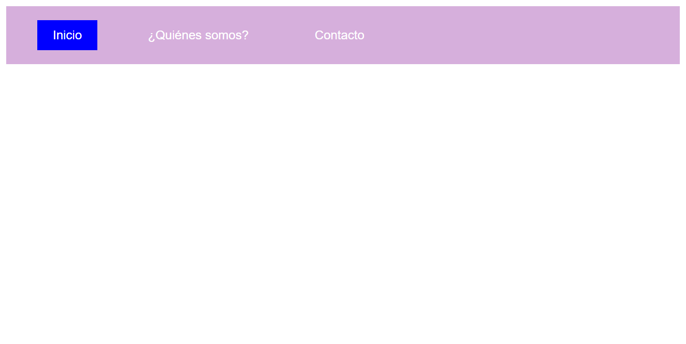
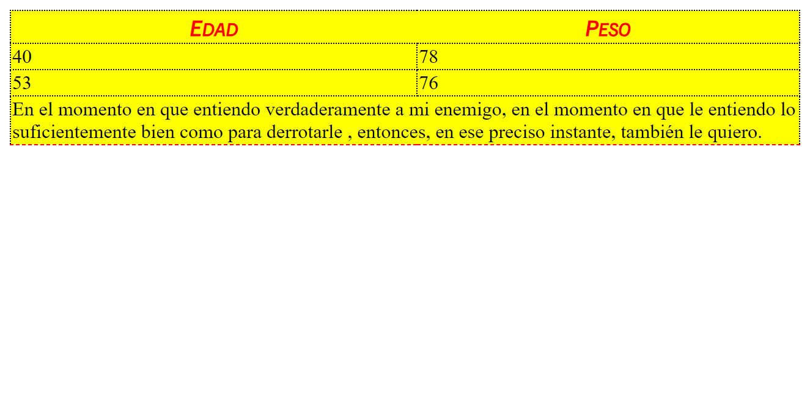

<h1>Taller 9 Alejandra Bolaños Ladrón de Guevara</h1>

<h2> Información</h2>

Curso: full Stack Basico - Grupo 1

Profesor: Cristian Patiño

<h3>Link página web</h3>
<a hred="https://kiwev.github.io/taller-9-full-stack/" target="blank">Link página web</a>

<h2> Punto 1: Link figma</h2>

<a href="https://www.figma.com/file/Wwn3jx30wFHTo1Dr6mGv0z/Alejandra-Bola%C3%B1os-Ladron-de-Guevara?type=design&node-id=6%3A528&mode=design&t=kWImBeeNWQ88etwj-1" target="_blank">Link de Figma</a>

<h2>Punto 2: HTML</h2>

<h2>Punto 3: CSS</h2>

<h2>Punto 4: Títulos</h2>

<h2>Punto 5: Párrafo</h2>

<h2>Punto 6: Links</h2>

<h2>Punto 7-8: Navegación</h2>

<h2>Punto 9: Tablas</h2>

